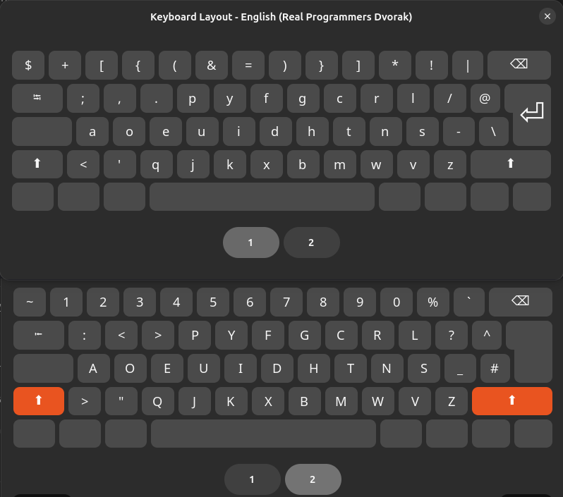

# Real Programmers Dvorak — Portable Wayland Setup

Custom XKB layout based on The Primeagen's Real Programmers Dvorak.

 


Designed for:

* Wayland-first Linux setups
* dotfiles management
* GNOME / Hyprland / Sway / KDE
* reproducible installs across distros

---

# Repository Structure

```text
└── dvorak/
    └── real-prog-dvorak
```

---

# Install

## 1. Clone Dotfiles

```bash
git clone https://github.com/j-waweru/dotfiles.git ~/dotfiles
cd dotfiles
```

---

# 2. Install Required Packages

## Ubuntu / Debian

```bash
sudo apt install xkb-data libxkbcommon-tools
```

## Arch Linux

```bash
sudo pacman -S xkeyboard-config libxkbcommon
```

## Fedora

```bash
sudo dnf install xkeyboard-config libxkbcommon
```

---

# 3. Symlink Layout into XKB

Wayland compositors reliably load layouts from:

```text
/usr/share/X11/xkb/symbols
```

Move file:

```bash
sudo cp \
"$HOME/dotfiles/dvorak/real-prog-dvorak" \
/usr/share/X11/xkb/symbols/real-prog-dvorak
```

Then you have to update the `sudo nvim /usr/share/X11/xkb/rules/evdev.xml` with the following,

```
<variant>
    <configItem>
        <name>real-prog-dvorak</name>
        <description>English (Real Programmers Dvorak)</description>
        <vendor>MichaelPaulson</vendor>
    </configItem>
</variant>
```

Restart Device

---

# 4. Validate the Layout

```bash
xkbcli compile-keymap \
--layout real-prog-dvorak
```

If successful, XKB will print a compiled keymap dump.

---

# GNOME Wayland Setup

Add layouts:

```bash

gsettings set org.gnome.desktop.input-sources sources \
"[('xkb', 'us'), ('xkb', 'us+dvp'), ('xkb', 'real-prog-dvorak')]"
```

Logout/login or reboot.

---

# GNOME Layout Switching

Default:

* `Super + Space`

---

# Hyprland Setup

Add to:

```text
~/.config/hypr/hyprland.conf
```

```ini
input {
    kb_layout = us,real-prog-dvorak
}
```

Reload:

```bash
hyprctl reload
```

Switch layouts:

```ini
bind = SUPER, SPACE, exec, hyprctl switchxkblayout current next
```

---

# Sway Setup

Add to:

```text
~/.config/sway/config
```

```ini
input * {
    xkb_layout us,real-prog-dvorak
}
```

Reload:

```bash
swaymsg reload
```

Switch layouts:

```ini
bindsym $mod+space input type:keyboard xkb_switch_layout next
```

---

# KDE Plasma Wayland

Add layout:

```bash
kwriteconfig5 --file kxkbrc \
--group Layout \
--key LayoutList \
"us,real-prog-dvorak"
```

Then relogin.

---

# Layout File

The layout file lives at:

```text
/usr/share/X11/xkb/symbols/real-prog-dvorak
```

Contents:

```xkb
// based on Michael Paulson's poor ideas.

partial alphanumeric_keys
xkb_symbols "real-prog-dvorak" {

    name[Group1]= "English (Real Programmers Dvorak)";

    key <TLDE> { [       dollar,        asciitilde, dead_grave, dead_tilde      ] };

    key <AE01> { [          plus,       1               ]       };
    key <AE02> { [          bracketleft,        2               ]       };
    key <AE03> { [          braceleft,  3       ]       };
    key <AE04> { [          parenleft,  4               ]       };
    key <AE05> { [          ampersand,      5               ]       };
    key <AE06> { [          equal,  6, dead_circumflex, dead_circumflex ]   };
    key <AE07> { [          parenright, 7       ]       };
    key <AE08> { [          braceright, 8       ]       };
    key <AE09> { [          bracketright,       9,  dead_grave] };
    key <AE10> { [          asterisk,   0       ]       };
    key <AE11> { [ exclam,      percent ]       };
    key <AE12> { [ bar, grave,  dead_tilde] };

    key <AD01> { [  semicolon,  colon, dead_acute, dead_diaeresis       ] };
    key <AD02> { [      comma,  less,   dead_cedilla, dead_caron        ] };
    key <AD03> { [      period, greater, dead_abovedot, periodcentered  ] };
    key <AD04> { [          p,  P               ]       };
    key <AD05> { [          y,  Y               ]       };
    key <AD06> { [          f,  F               ]       };
    key <AD07> { [          g,  G               ]       };
    key <AD08> { [          c,  C               ]       };
    key <AD09> { [          r,  R               ]       };
    key <AD10> { [          l,  L               ]       };
    key <AD11> { [      slash,  question        ]       };
    key <AD12> { [      at,     asciicircum             ]       };

    key <AC01> { [          a,  A               ]       };
    key <AC02> { [          o,  O               ]       };
    key <AC03> { [          e,  E               ]       };
    key <AC04> { [          u,  U               ]       };
    key <AC05> { [          i,  I               ]       };
    key <AC06> { [          d,  D               ]       };
    key <AC07> { [          h,  H               ]       };
    key <AC08> { [          t,  T               ]       };
    key <AC09> { [          n,  N               ]       };
    key <AC10> { [          s,  S               ]       };
    key <AC11> { [      minus,  underscore      ]       };

    key <AB01> { [   apostrophe,        quotedbl, dead_ogonek, dead_doubleacute ] };
    key <AB02> { [          q,  Q               ]       };
    key <AB03> { [          j,  J               ]       };
    key <AB04> { [          k,  K               ]       };
    key <AB05> { [          x,  X               ]       };
    key <AB06> { [          b,  B               ]       };
    key <AB07> { [          m,  M               ]       };
    key <AB08> { [          w,  W               ]       };
    key <AB09> { [          v,  V               ]       };
    key <AB10> { [          z,  Z               ]       };

    key <BKSL> { [  backslash,  numbersign             ]       };
};

```

---

# Troubleshooting

## `setxkbmap` Warning on Wayland

Expected:

```text
WARNING: Running setxkbmap against an Xwayland server
```

Wayland compositors do not use `setxkbmap` directly.

Use compositor configuration instead.

---

## Layout Does Not Appear

Verify:

```bash
ls /usr/share/X11/xkb/symbols/real-prog-dvorak
```

Then test:

```bash
xkbcli compile-keymap \
--layout real-prog-dvorak
```

---

