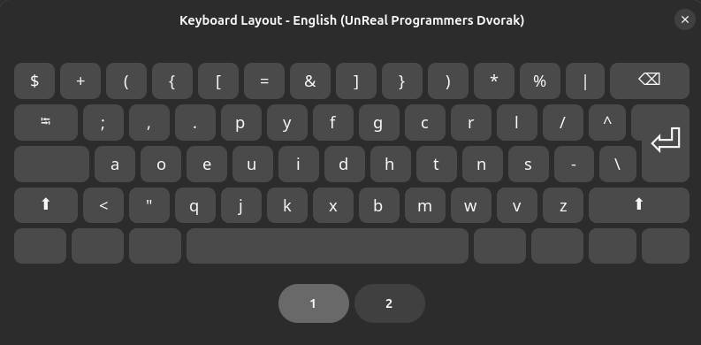
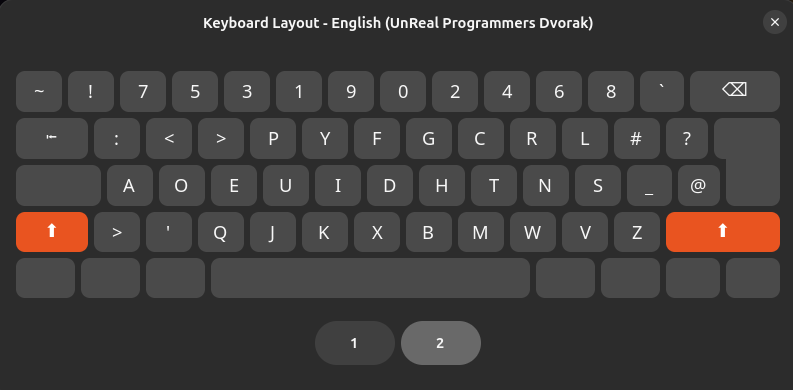

# ⌨️ Custom Keyboard layout config — Installation Guide

Includes two keyboard layouts for a custom qwerty and dvorak layout in the xkb dir.

Inspired by the primeagen's layout.


### Base layer 


### Shift layer


## 🐧 Linux Setup Steps (CachyOS, Ubuntu, Kali, REMnux)

Modern Linux setups using `libxkbcommon` read custom layouts directly from your user profile directory (`~/.config/xkb/`). This means you do not need root privileges or custom package helpers.

### 1. Clone the Repository

Open a terminal and clone your dotfiles repository directly into your home folder:

```bash
mkdir ~/dotfiles
git clone https://github.com/j-waweru/dotfiles.git ~/dotfiles

```

### 2. Safely Clear Existing Configurations

Before using GNU Stow, purge any default system-created `xkb` folders inside your configuration directory to prevent file linking blocks:

```bash
rm -rf ~/.config/xkb

```

### 3. Deploy Symlinks via Stow

Navigate into your repository base path and use `stow` to link the layout trees into your configuration directory:

```bash
cd ~/dotfiles
stow xkb

```

### 4. Activate the Desktop Environment Engine

#### 🎯 For Ubuntu / GNOME Environments

Force the background window system environment to flush its active source layout registers manually:

```bash
gsettings reset org.gnome.desktop.input-sources sources
gsettings reset org.gnome.desktop.input-sources mru-sources
gsettings set org.gnome.desktop.input-sources sources "[('xkb', 'us'),('xkb', 'unreal-prog-dvorak')]"

```

#### 🦎 For CachyOS (Hyprland)

Open Hyprland configuration file with text editor:

```bash
vi ~/.config/hypr/hyprland.conf

```

Update the `input` block:

```text
input {
    kb_layout = us
    kb_variant = unreal-prog-dvorak
}

```

#### 🐉 For Kali / REMnux (XFCE)

1. Open **Settings** -> **Keyboard** -> **Layout** tab selection.
2. Toggle off the **Use system defaults** selector checkbox.
3. Click **Add**, find and select `English (Unreal Programmers Dvorak)`

---

## ⚙️ Keyboard Remapping (keyd)

Install `keyd` via `paru -S keyd` or `sudo apt install keyd` and enable service `sudo systemctl enable --now keyd`.

mkdir -p /etc/keyd/default.conf

And add ; 

sudo nvim /etc/keyd/default.conf 

```ini

esc = capslock

leftalt = overload(alt, backspace)

rightalt = overload(altgr, enter)

capslock = overload(control, esc)

space = overload(shift, space)

```

Restart service to apply: `sudo systemctl restart keyd`.

---

## 🪟 Windows Setup Steps

> [!WARNING]
> Coming soon


