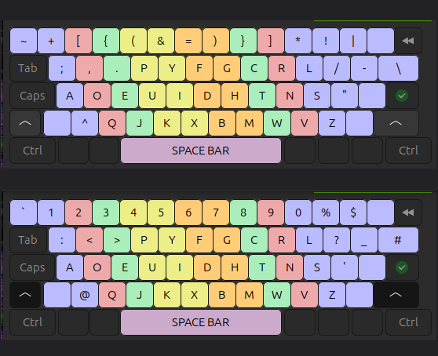

# ⌨️ Unreal Programmer's Dvorak — Installation Guide

Complete setup instructions to deploy my custom layout mostly *The Primeagen's Real Programmer's Dvorak* with some personal tweaks.




## 🐧 Linux Setup Steps (CachyOS, Ubuntu, Kali, REMnux)

Modern Linux setups using `libxkbcommon` read custom layouts directly from your user profile directory (`~/.config/xkb/`). This means you do not need root privileges or custom package helpers.

### 1. Clone the Repository
Open a terminal and clone your dotfiles repository directly into your home folder:

```bash
git clone https://github.com/j-waweru/dotfiles.git ~/dotfiles

```


### 2. Safely Clear Existing Configurations

Before using GNU Stow, purge any default system-created `xkb` folders inside your configuration directory to prevent file linking blocks:

```bash
rm -rf ~/.config/xkb

```

### 3. Deploy Symlinks via Stow

Navigate into your repository base path and use `stow` to link the layout trees into your configuration directory:

```bash
cd ~/dotfiles
stow xkb

```

*(Alternative: If `stow` is not installed on the system, link paths manually using absolute targets)*

```bash
mkdir -p ~/.config/xkb
ln -sf ~/dotfiles/xkb/.config/xkb/symbols ~/.config/xkb/symbols
ln -sf ~/dotfiles/xkb/.config/xkb/rules ~/.config/xkb/rules

```

### 4. Activate the Desktop Environment Engine

#### 🦎 For CachyOS (KDE Plasma)

1. Open **System Settings** -> **Input Devices** -> **Keyboard**.
2. Click the **Add...** layout action button.
3. Type and select `English (Unreal Programmers Dvorak)`.
4. Move this layout entry to the top position block and hit **Apply**.

#### 🐉 For Kali / REMnux (XFCE)

1. Open **Settings** -> **Keyboard** -> **Layout** tab selection.
2. Toggle off the **Use system defaults** selector checkbox.
3. Click **Add**, find and select `English (Unreal Programmers Dvorak)`.

#### 🎯 For Ubuntu / GNOME Environments

Force the background window system environment to flush its active source layout registers manually:

```bash
gsettings reset org.gnome.desktop.input-sources sources
gsettings reset org.gnome.desktop.input-sources mru-sources
gsettings set org.gnome.desktop.input-sources sources "[('xkb', 'us'), ('xkb', 'unreal-prog-dvorak')]"

```

---

## 🪟 Windows Setup Steps

> [!WARNING]
> This is for the original RPD. I haven't ported my own custom tweaks to windows. Plans to change later.


### 1. Grab Your Dotfiles Tree

Clone your active configurations repository inside your user profile directory path or download it directly from your provider:

```cmd
git clone https://github.com/j-waweru/dotfiles.git %USERPROFILE%\dotfiles

```

### 2. Install Microsoft Keyboard Layout Creator (MSKLC)

* Download and run the official compiler framework: [MSKLC Utility](https://www.microsoft.com/en-us/download/details.aspx?id=102134)

### 3. Open and Build the Layout Binary

1. Launch the **MSKLC** tool executable layout container.
2. Go to **File** -> **Load Source File...**
3. Navigate into your workspace clone path: `dotfiles\xkb\.config\xkb\symbols\` and load the target file: `real-prog-dvorak.klc`
4. Select **Project** -> **Build DLL and Setup Package** from the top menu tray.

### 4. Run System Setup Driver

1. Open the freshly generated build deployment directory output.
2. Double-click the main launch controller installer: `setup.exe`
3. Restart your workstation machine framework host.
4. Use the hotkey combo `Win + Space` to alternate and toggle `English (Real Programmers Dvorak)` live.

```

